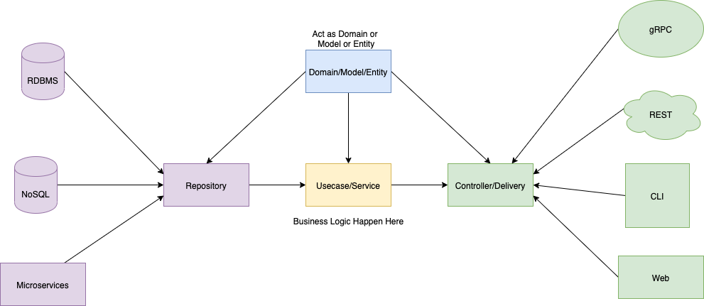
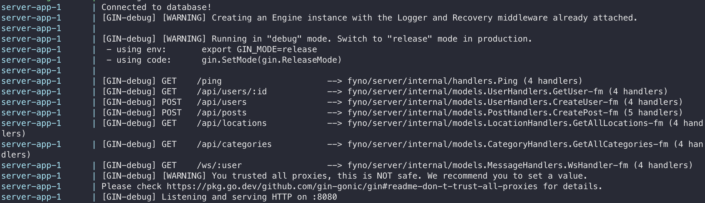

# Find Your Next Owner (Server)

This is the server for the Find Your Next Owner app. It is built using Go and uses a PostgreSQL database.

## Structure


## Installation

1. Clone the repo
```bash
git clone https://github.com/vincent0426/fyno-server.git
```

2. Go into the directory
```bash
cd fyno-server
```

3. Copy the `.env.example` file to `.env` and fill in the values
```bash
cp .env.example .env
```

4. Run the server
```bash
docker-compose up
```

5. Should see the following in the terminal


6. Open [http://localhost:8080/ping](http://localhost:8080/ping) in your browser

You should see the following message:
```json
{
    "message": "pong"
}
```

## Adding data
1. Open the terminal and run the following command to enter the database
```shell
docker ps
```

2. Copy the container id of the `postgres:latest` container and run the following command, replacing `<container id>` with the container id
```shell
docker exec -it <container id> bash
```

3. Run the following commands to go into the database
```shell
psql -U fynouser fyno
```

4. Run the following commands to add data
```sql
INSERT INTO categories (id, name)
VALUES 
    ('7e044a10-15d8-46a8-9b2f-267207a4f7d4', '狗'),
    ('4e1c7dc4-035c-4c1c-8a9b-9f6aa5f5f5d5', '貓'),
    ('df3b15d3-86d1-4bc2-8ed9-70a6896b6397', '兔子'),
    ('c4d5574c-1cf6-4cd6-a10d-55a48b7f9ed4', '烏龜'),
    ('e5fa5f5b-1376-49e6-a3f6-1c6e5f6ef9c6', '鼠'),
    ('a9cf2f27-7662-474c-9b90-61cc8d47be71', '鳥'),
    ('d74b9e26-d3f8-43c1-8a20-03873629b0f8', '蛇'),
    ('0d156b19-c2c9-49e9-b8a8-55b49d32c141', '雞');
    
INSERT INTO locations (id, name) VALUES
('c71b5d8b-3081-4f5a-84b6-3f3a206da951', '臺北市'),
('95a8f04a-6ee4-4a1d-9e3a-15cdaafbcc9e', '新北市'),
('7d4a0c4e-4fbf-4e8b-83a5-c9952e9d5105', '桃園市'),
('5a7a7360-07de-441a-bfc9-78fc64b10c15', '臺中市'),
('2ca2b73e-231a-49e2-bddc-c1f9a1d269e8', '臺南市'),
('cf70e2b6-c953-45c4-b4f4-6d69f3ecb3c7', '高雄市'),
('862f74e9-0a0a-4a5d-86a1-0f08c38f0d8a', '新竹縣'),
('2b2bbba8-7d5e-4555-9dc8-07c4501a3b3a', '苗栗縣'),
('a542ff2e-19c7-4d22-8dc7-b3a682efce9e', '彰化縣'),
('2edc39a6-b29a-4d53-9df1-fc70a9b50fc2', '南投縣'),
('0e1a112f-9219-475a-a30c-73c82429db36', '雲林縣'),
('c08eb0cc-a05c-44b9-b456-82dd8802cf49', '嘉義縣'),
('f72cc787-39cc-42d9-82b3-2bcbf437ea70', '屏東縣'),
('44db1c78-c720-4d17-844d-05087e4d4c4a', '宜蘭縣'),
('8995f0a9-5aa5-4d5d-a441-c60b1317e3a3', '花蓮縣'),
('bb1af42a-7217-422e-aaf3-63f70708ecb1', '臺東縣'),
('a0f79b3c-19da-442d-8e90-3900bdfc25f9', '澎湖縣'),
('73e4ebf4-4a34-4ef4-8c2b-9a5c5b5d5b5c', '金門縣'),
('5102d3a6-9d6e-4f98-9f7c-251c84c7d71d', '連江縣'),
('ebd66df6-11a6-4a08-840c-4f8f4c4d25ad', '基隆市'),
('d9c885bc-5c77-4b7a-b283-e06b2514464b', '新竹市'),
('2aae53da-59c6-4b3b-876d-7e49d81af5d9', '嘉義市');
```